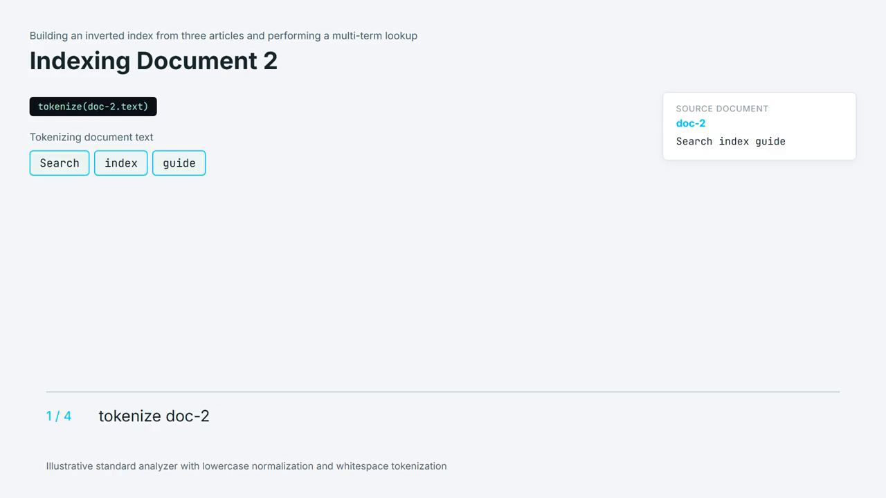

# AI Educational Video Generator

**Turn a topic into an editable storyboard and a narrated video.**

A local application for exploring how AI-generated teaching content can become an animated educational video. Enter a topic, review and edit the proposed storyboard, then render an MP4 with narration.

For someone making an explainer, it brings scripting, scene selection, speech, and rendering into one workflow. Generated explanations still need human fact-checking and editorial review.


[Quick start](#try-it-locally) · [Architecture](#how-it-is-built) · [Recorded validation](IMPLEMENTATION_STATUS.md) · [Portfolio](https://github.com/Dhruvil151)

## Watch a narrated output

[](docs/narrated-example.mp4)

[Watch or download the 40-second narrated excerpt](docs/narrated-example.mp4). This is an excerpt from an existing local render, not a new live generation session. It shows document tokenization and posting-list construction in a simplified teaching model. [Provenance and limitations](docs/NARRATED_DEMO.md).

## See an animation sample


A real render of the included, deterministic cache demonstration. This silent sample uses a test fixture; it is not a freshly AI-generated lesson or a voice-quality demonstration. [Download the MP4](docs/demo-cache.mp4) · [How to reproduce it](docs/PREVIEW.md).

## A simple example

Enter “JavaScript closures.” The app asks Gemini for a teaching plan and visual storyboard. Review the narration and scenes, edit the JSON if needed, and submit a background render. Speech synthesis, React-based animation, and video assembly produce the downloadable result.

This describes the intended workflow; generation time and output quality depend on the topic, hardware, and provider availability.

## What it does

- Generates structured storyboards rather than a single block of narration.
- Lets you review and save edits before rendering.
- Supports code scenes, comparisons, diagrams, and bounded mechanism demonstrations.
- Queues render jobs and reports progress separately from the web interface.
- Caches intermediate assets and saves render manifests for inspection and replay.
- Produces video output and captions when timing information is available.

## Try it locally

Use Node.js 22 or 24, Python 3.10+ available as `python`, and Docker with Compose. Live generation needs your own Gemini API key and network access for speech synthesis.

```sh
npm ci
python -m pip install edge-tts
```

Copy `.env.example` to `.env` and set `GEMINI_API_KEY`. Then:

```sh
docker compose up -d
npm run dev
```

Open **http://localhost:5173**. The API runs on port 3001; the worker handles rendering in the background. Generate a storyboard, inspect it, then start the render.

Provider quotas, model availability, third-party licenses, and hardware requirements apply. This project does not promise zero cost or a fixed completion time. Optional stock footage requires its own configured provider key.

## How it is built

**Node.js / Express · Gemini · BullMQ / Redis · React / Remotion · Edge TTS · FFmpeg**

The browser dashboard lives in `public/` and is bundled with Vite. React components in `src/remotion/` render the video scenes. Express accepts script and render requests; BullMQ and Redis separate long-running work from the HTTP interface. Python handles speech synthesis, Remotion renders visuals, and FFmpeg assembles media.

**Design decisions worth exploring:** structured storyboard validation before synthesis; narration and visual timing handled separately; deterministic instructional examples; cached assets and manifests for diagnosing rendering problems.

For implementation details, see [project documentation](PROJECT_DOCUMENTATION.md) and the [implementation status](IMPLEMENTATION_STATUS.md). Historical notes may describe older layouts; current source and checks are the reference for behavior.

## Engineering decisions

### Separate requests from rendering

Express accepts requests while BullMQ and Redis dispatch long-running rendering to a worker. The browser can poll progress without keeping a single HTTP request open for the entire render. This local design is not a multi-user hosting service.

### Review content before spending render time

The workflow exposes an editable storyboard and validates its structure before rendering. Users can correct narration and scene choices before synthesis. Structural checks do not prove factual accuracy.

### Reuse intermediate work

Audio and scene caches retain intermediate media, while manifests record inputs and timing. This supports inspection and reuse; full bit-identical historical replay is not guaranteed.

### Use React for video composition

Remotion components express scenes and animation; the browser dashboard is plain JavaScript bundled by Vite. Scene rendering benefits from reusable components without claiming the dashboard itself is a React application.

## Checks and evidence

```sh
npm run test:local
npx tsc --noEmit
npm run build
```

These checks do not require a new Gemini request or speech generation. Tests include local FFmpeg operations. [GitHub Actions](https://github.com/Dhruvil151/ai-video-generator/actions) records results for commits with the workflow enabled.

The implementation report records a completed end-to-end render, but also identifies unresolved pacing, factual-content, and visual-consistency issues. Treat it as a working prototype, not an automatically publication-ready video service.

## Current scope

- Review generated teaching claims, examples, timing, and visual continuity before sharing a video.
- Detailed-mode quality and broad input coverage need further validation.
- Some caption timing is approximate; a media file passing decode checks does not prove teaching quality.
- This is a local development application, not a hardened public multi-user service.
- The project code is MIT licensed; third-party libraries, fonts, logos, and media retain their own terms.


## License

Original project code and documentation are available under the [MIT License](LICENSE). Third-party dependencies and assets retain their own licenses; see [third-party notices](THIRD_PARTY_NOTICES.md).
